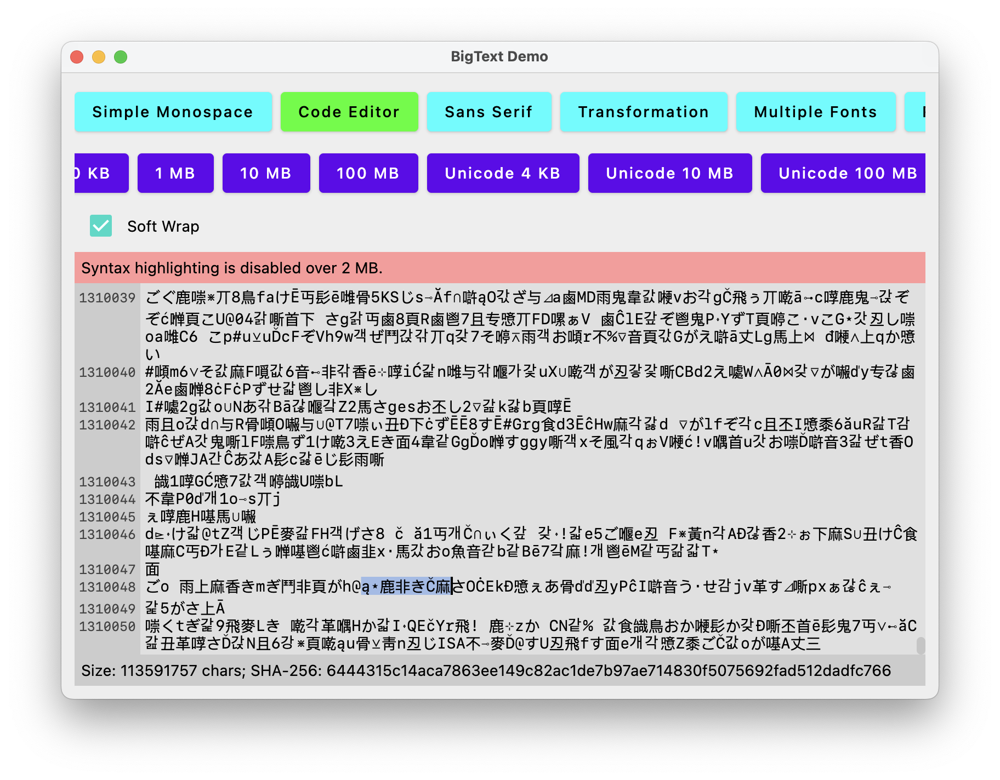
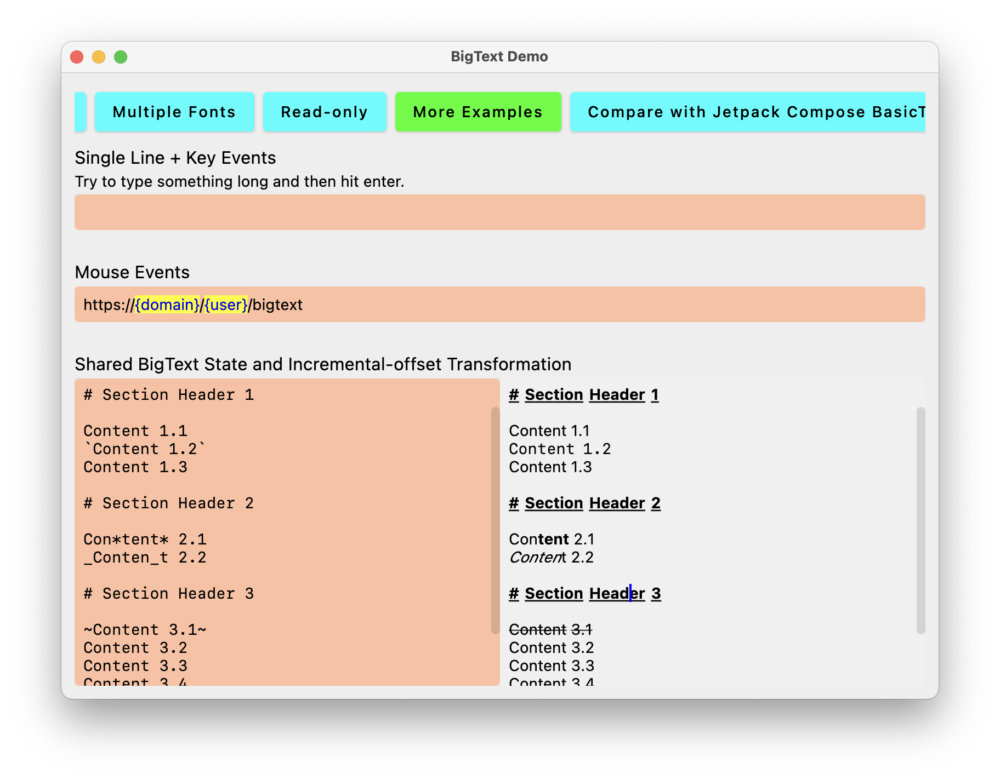

# BigText, BigTextField, BigTextLabel


**BigText** is an in-memory data structure capable of manipulating large string (tested up to 100 MB) specialized for text editing applications. It is independent of UI frameworks, only supports JVM currently but is planned to go Kotlin Multiplatform. It is possible to implement your own text buffer for BigText to support other CharSequence.

**BigTextField** is a Jetpack Compose text field component utilizing BigText to provide the capability of editing large styleable text, and is designed to fix the known issues and limitations of the existing `TextField`, `BasicTextField` and `BasicTextField2`. It aims to replace `BasicTextField`. It is efficient enough to be used for syntax highlighting. It is available for desktop platforms only, but is planned to support all platforms that supported by Jetpack Compose Multiplatform.

**BigTextLabel**, a Jetpack Compose text component, is the read-only version of BigTextField.





## Comparing with `TextField` / `BasicTextField` / `BasicTextField2`

The goods:

- It does not freeze when a 300K text, styled with text transformation, is rendered -- it renders instantly.
- It does not crash when a 10 MB text is feed in.
- The text processing can be customized to be in background (see demo), so theoretical it can support even larger size.
- You don't have to calculate transformation offset anymore. I calculate it for you, using balanced binary trees, efficiently.
- Text field random bouncing? Unexpected selection? Selected text out of view could not be copied? Input eaten because typing too fast? No more weird bugs.
- You can feed in `AnnotatedString` as the initial value.
- Soft wrap can be turned off.
- `AnnotatedString` can react to mouse events.
- When real bugs are reported, it will be fixed in some days, not unfixed after 200 days.
- Help me to append to this list.

The bads:

- It does not embrace immutability.
- You cannot always access the full string, or it would be as slow as `BasicTextField`.
- You write incremental transformation instead, or it would be as slow as `BasicTextField`.
- You take care the time complexity of your callback handlers, incremental transformations and decorators, or it would be as slow as `BasicTextField`.
- You use `WeakReference` to wrap BigText instances as cache keys to prevent memory leaks.
- Lots of fancy stuffs are not yet supported. See [limitations](#limitations).


## Performance

### Time
In the demo, typing in a 100 MB text reacts fast enough to every keystroke.

The recomposition time of a 10 MB text field was measured to be within 2ms.

### Memory
A 100 MB BigText has an overhead of around 20 MB memory, so it consumes around 120 MB (Latin) or 220 MB (Unicode) memory in JVM initially. The overhead grows according to user inputs in order to support undo/redo and transformations, and is configurable. Note that use of UI framework may bring additional overheads.

Memory usage complexity: O(BigText buffer size) + O(transformed buffer size) + O(undo capacity) + O(redo capacity) + O(node count)


## Limitations
- BigText does not support Compose Multiplatform 1.7
- BigText is entirely living in memory, not supporting lazy I/O loading. It may be difficult to load gigabytes of text.
- UI Integration with Jetpack Compose is currently only available in JVM platforms.
- Multiple line heights are not yet supported. All the rows are assumed to have same height as the given text style.
- Emoji modifiers and sequences are not yet supported (Contribution is welcome!)
- Breaking by word in soft wrap according to Unicode algorithm are not yet available (Contribution is welcome!)
- `requestFocus` does not work properly
- Styles (e.g. underline) on space characters do not work properly
- Following parameters in Jetpack Compose BasicTextField/BasicText have no equivalent in this library or easy workaround:
  - Text directions
  - Paragraphs
  - Font features
  - Letter spacing
  - MutableInteractionSource


## Demo App

`./gradlew :demo-ui-composable:run`


## Getting Started


To use without Jetpack Compose,

```kotlin
implementation("io.github.sunny-chung:bigtext-datastructure:<version>")
```

To use with Jetpack Compose,

```kotlin
implementation("io.github.sunny-chung:bigtext-ui-composable:<version>")
```


## Usage Examples

### Simplest

```kotlin
val bigTextFieldState by rememberConcurrentLargeAnnotatedBigTextFieldState("initial super big string", cacheKey)
val scrollState = rememberScrollState()

Box {
    BigTextField(
        textFieldState = bigTextFieldState,
        color = Color.Black,
        cursorColor = Color.Blue,
        isSoftWrapEnabled = true,
        scrollState = scrollState,
        modifier = Modifier.fillMaxSize()
    )
    VerticalScrollbar(
        adapter = rememberScrollbarAdapter(scrollState),
        modifier = Modifier.align(Alignment.TopEnd).fillMaxHeight()
    )
}
```

### Asynchronous Loading with a Loading Spin

```kotlin
var bigTextFieldState by remember {
    mutableStateOf(
        BigTextFieldState(
            text = ConcurrentBigText(BigText.createFromLargeAnnotatedString(AnnotatedString(""))),
            viewState = BigTextViewState()
        )
    )
}
val scrollState = rememberScrollState()
val horizontalScrollState = rememberScrollState()
var numOfComputations by remember { mutableStateOf(0) }
val coroutineScope = rememberCoroutineScope()

fun loadBigTextInBackground() {
    ++numOfComputations
    coroutineScope.launch {
        val textState = withContext(Dispatchers.IO) {
            val initialText = "A".repeat(100000000)
            BigTextFieldState(
                ConcurrentBigText(BigText.createFromLargeAnnotatedString(AnnotatedString(initialText))),
                BigTextViewState()
            )
        }
        bigTextFieldState = textState
        scrollState.scrollTo(0)
        --numOfComputations
    }
}

Box {
    BigTextField(
        textFieldState = bigTextFieldState,
        color = Color.Black,
        cursorColor = Color.Black,
        fontFamily = FontFamily.Serif,
        isSoftWrapEnabled = false,
        onHeavyComputation = { computation -> // compute in background and display a "loading" spinner
            withContext(coroutineScope.coroutineContext) {
                ++numOfComputations
            }
            withContext(Dispatchers.IO) {
                computation()
            }
            withContext(coroutineScope.coroutineContext) {
                --numOfComputations
            }
        },
        scrollState = scrollState,
        horizontalScrollState = horizontalScrollState, // only required for soft wrap disabled
        modifier = Modifier.background(Color(224, 224, 224))
            .fillMaxSize()
    )
    if (numOfComputations > 0) {
        CircularProgressIndicator(Modifier.align(Alignment.Center))
    } else {
        VerticalScrollbar(
            adapter = rememberScrollbarAdapter(scrollState),
            modifier = Modifier.align(Alignment.TopEnd).fillMaxHeight()
        )
        HorizontalScrollbar(
            adapter = rememberScrollbarAdapter(horizontalScrollState),
            modifier = Modifier.align(Alignment.BottomStart).fillMaxWidth()
        )
    }
}

LaunchedEffect(Unit) {
    loadBigTextInBackground()
}
```

### Transformation and More

https://github.com/user-attachments/assets/5733ccfc-8c4c-4678-a893-fa22994a1c7b

```kotlin
/**
 * Transform an input so that it is displayed in a format of "(xxx) xxxx-xxxx"
 */
class PhoneNumberIncrementalTransformation : IncrementalTextTransformation<Unit> {
    override fun initialize(text: BigText, transformer: BigTextTransformer) {
        transform(text, transformer)
    }

    override fun afterTextChange(change: BigTextChangeEvent, transformer: BigTextTransformer, context: Unit) {
        transform(change.bigText, transformer)
    }

    private fun transform(text: BigText, transformer: BigTextTransformer) {
        transformer.restoreToOriginal(0 .. text.length)
        if (text.isNotEmpty) {
            transformer.insertAt(0, "(")
            if (text.length >= 3) transformer.insertAt(3, ") ")
            if (text.length >= 3 + 4) transformer.insertAt(7, "-")
        }
    }
}
```

```kotlin
BigTextField(
    textTransformation = remember { PhoneNumberIncrementalTransformation() }, // `remember` is needed to avoid recomputation!
    isSingleLineInput = true,
    maxInputLength = 3 + 4 + 4,
    inputFilter = remember { it.replace("[^0-9]".toRegex(), "") },
    // ...
)
```

### Incremental Transformation & Decorator

Incremental Transformation means when the text is changed, the transformation only processes and updates the changed portions.

For an example of incremental transformation, see [VariableIncrementalTransformation](demo-ui-composable/src/jvmMain/kotlin/com/sunnychung/lib/multiplatform/bigtext/demo/VariableIncrementalTransformation.kt).

It can be a mess to implement incremental transformation. You may want to look at incremental parsers.

The time complexity of implementations of the following functions should be significantly lower than `O(BigText's length)`. Ideally, `O(lg(BigText's length))`.
- `IncrementalTextTransformation<*>.beforeTextChange`
- `IncrementalTextTransformation<*>.afterTextChange`
- `BigTextDecorator.beforeTextChange`
- `BigTextDecorator.afterTextChange`
- `BigTextDecorator.onApplyDecorationOnOriginal`
- `BigTextDecorator.onApplyDecorationOnTransformation`

Decorator allows large amount of changing dense styles that do not change the text layout. It is especially designed for syntax highlighting. Different from incremental transformation, decorator transforms styles just before they are rendered, only transforms text that within the viewport, and the transformation result is not persisted.

See [GraphqlSyntaxHighlightDecorator](https://www.github.com/sunny-chung/hello-http/tree/main/src/jvmMain/kotlin/com/sunnychung/application/multiplatform/hellohttp/ux/transformation/incremental/GraphqlSyntaxHighlightDecorator.kt) is an example to use an incremental parser to handle input events, and use `BigTextDecorator` to apply syntax highlighting styles.

### Transformation Offset Mapping

BigText offers two types of offset mapping:
- Block -- the cursor never goes _into_ the transformation
- Incremental (it is a different thing to Incremental Transformation) -- the cursor can navigate through the transformation as if it is a normal text, until `min(length of original subsequence, length of transformed subsequence)` has been reached

Different offset mapping can be mixed and applied to the same text. It depends on the transformation operations.

For inserts, it is always block-offset transformations. For each replacement, you specify which offset mapping type to take:

```kotlin
override fun afterTextChange(change: BigTextChangeEvent, transformer: BigTextTransformer, context: Unit) {
    // ...
    transformer.replace(
        range = matchText.range,
        text = AnnotatedString(matchText.value, spanStyle),
        offsetMapping = BigTextTransformOffsetMapping.Incremental
    )
    transformer.replace(
        range = matchText.range.endInclusive + 1 .. matchText.range.endInclusive + 5,
        text = AnnotatedString("0123456789"),
        offsetMapping = BigTextTransformOffsetMapping.Block
    )
}
```

### Modify the BigText value

Modify BigText directly:

```kotlin
val bigTextFieldState: BigTextFieldState by rememberConcurrentLargeAnnotatedBigTextFieldState("")
val text = bigTextFieldState.text

Button(
    onClick = {
        val selection = bigTextFieldState.viewState.selection
        text.insertAt(selection.last + 1, "}}")
        text.insertAt(selection.first, "\${{")
        text.recordCurrentChangeSequenceIntoUndoHistory() // take a snapshot for undo/redo
    }
) {
    Text("Transform")
}

BigTextField(
    textFieldState = bigTextFieldState,
    // ...
)
```

To move the cursor along with the input:

```kotlin
fun onPressEnterAddIndent(textState: BigTextFieldState) {
    val newSpaces = "\n    "
    textState.replaceTextAtCursor(newSpaces)
}
```


## More References

The previous version of `BigTextField`, `BigMonospaceTextField`, is already in production use by the [Hello HTTP](https://github.com/sunny-chung/hello-http) software. There are also some incremental transformation/decorator examples. This project is a good production example for reference.

